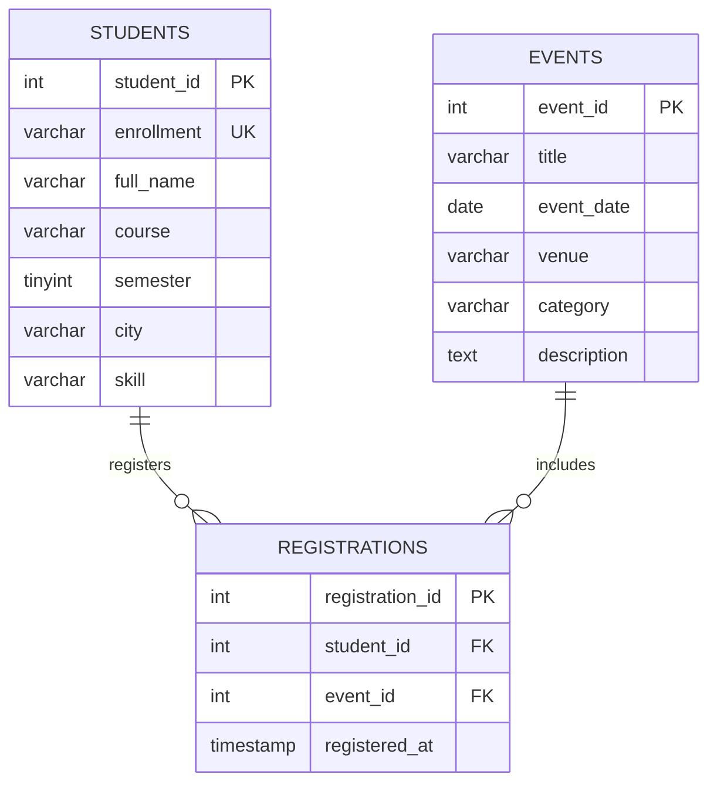

# StudentHub ER Model (Practical 8)

**Relations:** Students (1) to registrations (many); Events (1) to registrations (many). A student may attend many events, and an event may have many students. Unique `(student_id, event_id)` prevents duplicate registrations.

**Normalization:** All tables satisfy 1NF with atomic fields; 2NF because non-key fields describe their table's key; 3NF because student attributes and event attributes are separated from the junction table. No repeating groups or duplicated event/student fields in registrations.
